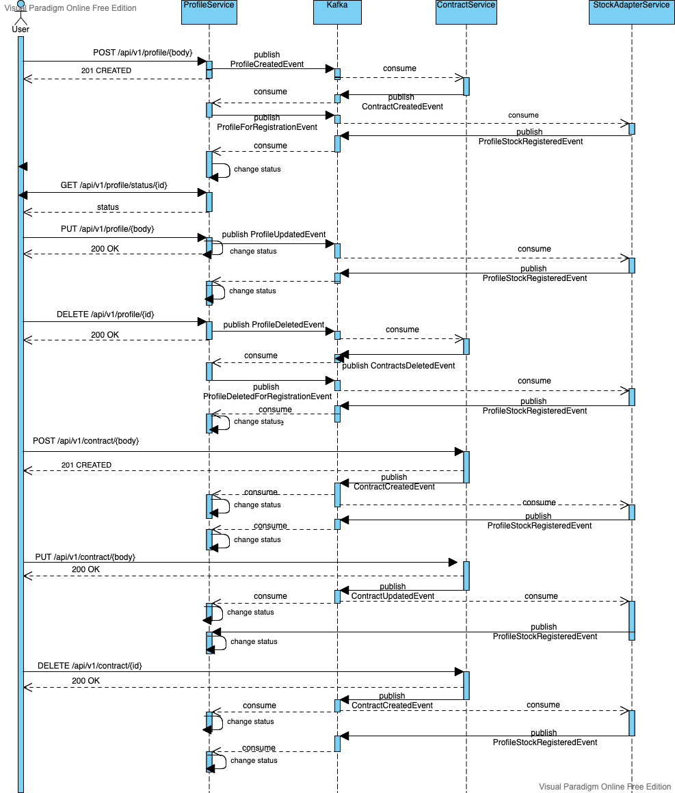

# Проект "Брокерское обслуживание клиентов с использованием микросервисной архитектуры"

- [Пользовательские сценарии](./decomposition.md#Пользовательские-сценарии)
- [Общую схему взаимодействия сервисов](./decomposition.md#Схема-взаимодействия-сервисов)
- [Для каждого сервиса опишите назначение сервиса и его зону ответственности](./decomposition.md#Описание-сервисов)
- [Опишите контракты взаимодействия сервисов друг с другом](./decomposition.md#Описание-сервисов)


----
###Запустить minikube

```shell script
minikube start  --kubernetes-version="v1.19.0" 
eval $(minikube docker-env)
minikube addons  enable ingress
```

Создаем неймспейсы :
```shell script
kubectl apply -f namespaces.yaml
```

### Разворачиваем Prometheus
```shell script

helm repo add prometheus-community https://prometheus-community.github.io/helm-charts


helm install prom prometheus-community/kube-prometheus-stack -f prometheus/prometheus.yaml --atomic
helm install nginx ingress-nginx/ingress-nginx -f prometheus/nginx-ingress.yaml --atomic


kubectl port-forward service/prom-grafana 9000:80
kubectl port-forward service/prom-kube-prometheus-stack-prometheus 9090
```


### Grafana
```shell
username: admin
password: kubectl get secret --namespace default prom-grafana -o jsonpath="{.data.admin-password}" | base64 --decode ; echo
```

```shell script
helm repo add bitnami https://charts.bitnami.com/bitnami
helm install zookeeper bitnami/zookeeper --set replicaCount=1 --set auth.enabled=false --set allowAnonymousLogin=true   --namespace=messaging
helm install kafka bitnami/kafka --set zookeeper.enabled=false --set replicaCount=1 --set externalZookeeper.servers=zookeeper.messaging.svc.cluster.local  --namespace=messaging
```

Разворачиваем сервисы
---------
```shell script
cd profileService 

Skaffold run
```
---------

```shell script
cd contractService

Skaffold run
```
---------
```shell script
cd stockAdapterService

Skaffold run
```
---------

```shell script
cd authService 

Scaffold run
```


### Получаем адрес сервиса, чтобы прописать его в /etc/hosts: 

```shell script
minikube service ingress-nginx-controller  --url -n ingress-nginx
```


### Запуск тестов
```shell script
newman run postman/postman_collection.json
```

```
All services test

→ регистрация пользователя
  POST http://arch.homework:61467/register [200 OK, 146B, 82ms]
  ✓  [INFO] Request: {
	"login": "Valentine21", 
	"password": "Q15AuZ_opQ0SfoN",
	"email": "Verna_Runolfsson@yahoo.com",
	"first_name": "Vincent",
	"last_name": "Marvin"
}

  ✓  [INFO] Response: {
  "id": 9
}


→ логин
  POST http://arch.homework:61467/login [200 OK, 236B, 19ms]
  ✓  [INFO] Request: {"login": "Valentine21", "password": "Q15AuZ_opQ0SfoN"}
  ✓  [INFO] Response: {
  "status": "ok"
}


→ проверить данные о пользователе 
  GET http://arch.homework:61467/auth [200 OK, 385B, 10ms]
  ✓  [INFO] Request: [object Object]
  ✓  [INFO] Response: {
  "email": "Verna_Runolfsson@yahoo.com", 
  "first_name": "Vincent", 
  "id": 9, 
  "last_name": "Marvin", 
  "login": "Valentine21"
}

  ✓  test token data

→ Создание профиля
  POST http://arch.homework:61467/profile/ [201 Created, 352B, 30ms]
  ✓  [INFO] Request: {
	"userId": "1",
	"firstName": "Rodolfo", 
	"middleName": "Garnett",
    "lastName":"Torp",
    "countryCode":"767",
    "documentType":"870",
    "documentSeries":"596",
    "documentNumber":"895"
    }

  ✓  [INFO] Response: {"id":10,"userId":1,"firstName":"Rodolfo","middleName":"Garnett","lastName":"Torp","status":"ON_REGISTRATION","countryCode":"767","documentType":870,"documentSeries":"596","documentNumber":"895","version":0}

→ Получаем статус зарегистрированного профиля
  GET http://arch.homework:61467/profile/status/10 [200 OK, 150B, 12ms]
  ✓  [INFO] Request: [object Object]
  ✓  [INFO] Response: REGISTERED

→ Изменяем профиль
  PUT http://arch.homework:61467/profile/ [200 OK, 362B, 53ms]
  ✓  [INFO] Request: {   "id":10,
	"userId": "1",
	"firstName": "FirsName71", 
	"middleName": "MiddleName71",
    "lastName":"LasName",
    "countryCode":"643",
    "documentType":"21",
    "documentSeries":"1111",
    "documentNumber":"222222",
    "version":"1"
    }

  ✓  [INFO] Response: {"id":10,"userId":1,"firstName":"FirsName71","middleName":"MiddleName71","lastName":"LasName","status":"ON_REGISTRATION","countryCode":"643","documentType":870,"documentSeries":"1111","documentNumber":"222222","version":1}

→ Получаем статус профиля после изменения
  GET http://arch.homework:61467/profile/status/10 [200 OK, 150B, 12ms]
  ✓  [INFO] Request: [object Object]
  ✓  [INFO] Response: REGISTERED

→ Создание договора
  POST http://arch.homework:61467/contract/ [201 Created, 266B, 68ms]
  ✓  [INFO] Request:     {
        "profileId": 10,
        "number": "555",
        "marketPlaceFx": false,
        "marketPlaceForts": false,
        "marketPlaceFond": true,
        "version": 0
    }
  ✓  [INFO] Response: {"id":18,"profileId":10,"number":"555","marketPlaceFx":false,"marketPlaceForts":false,"marketPlaceFond":true,"version":0}

→ Удаляем профиль, получаем статус DELETE_REJECTED так как есть договор с открытой фондовой площадкой
  DELETE http://arch.homework:61467/profile/10 [200 OK, 99B, 16ms]
  ✓  [INFO] Request: [object Object]
  ✓  [INFO] Response: 

→ Получаем статус профиля
  GET http://arch.homework:61467/profile/status/10 [200 OK, 155B, 15ms]
  ✓  [INFO] Request: [object Object]
  ✓  [INFO] Response: DELETE_REJECTED

→ Изменяем договор
  PUT http://arch.homework:61467/contract/ [200 OK, 294B, 67ms]
  ✓  [INFO] Request:     {
        "id": 18,
        "profileId": 10,
        "number": "927e1f7f-1770-47a1-9ecd-156d9bce4311",
        "marketPlaceFx": true,
        "marketPlaceForts": false,
        "marketPlaceFond": false,
        "version": 0
    }
  ✓  [INFO] Response: {"id":18,"profileId":10,"number":"927e1f7f-1770-47a1-9ecd-156d9bce4311","marketPlaceFx":true,"marketPlaceForts":false,"marketPlaceFond":false,"version":1}

→ Удаляем профиль, получаем статус DELETE_REGISTERED так как уже нет договора с открытой фондовой площадкой
  DELETE http://arch.homework:61467/profile/10 [200 OK, 99B, 23ms]
  ✓  [INFO] Request: [object Object]
  ✓  [INFO] Response: 

→ Получаем статус профиля
  GET http://arch.homework:61467/profile/status/10 [200 OK, 157B, 31ms]
  ✓  [INFO] Request: [object Object]
  ✓  [INFO] Response: DELETE_REGISTERED

→ логаут
  GET http://arch.homework:61467/logout [200 OK, 225B, 10ms]
  ✓  [INFO] Request: [object Object]
  ✓  [INFO] Response: {
  "status": "ok"
}


┌─────────────────────────┬───────────────────┬──────────────────┐
│                         │          executed │           failed │
├─────────────────────────┼───────────────────┼──────────────────┤
│              iterations │                 1 │                0 │
├─────────────────────────┼───────────────────┼──────────────────┤
│                requests │                14 │                0 │
├─────────────────────────┼───────────────────┼──────────────────┤
│            test-scripts │                27 │                0 │
├─────────────────────────┼───────────────────┼──────────────────┤
│      prerequest-scripts │                17 │                0 │
├─────────────────────────┼───────────────────┼──────────────────┤
│              assertions │                29 │                0 │
├─────────────────────────┴───────────────────┴──────────────────┤
│ total run duration: 16.8s                                      │
├────────────────────────────────────────────────────────────────┤
│ total data received: 949B (approx)                             │
├────────────────────────────────────────────────────────────────┤
│ average response time: 32ms [min: 10ms, max: 82ms, s.d.: 23ms] │
└────────────────────────────────────────────────────────────────┘
```


### Stress-Testing
```shell script
newman run postman/postman_collection.json -n 50

```
---
#### 📚 Дипломный проект разработан для курса "[Microservice Architecture](https://otus.ru/lessons/microservice-architecture/)"

