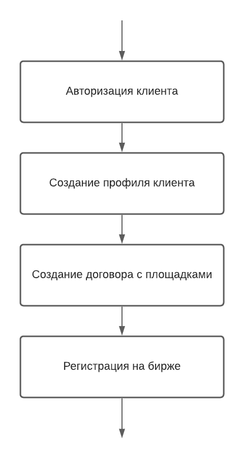
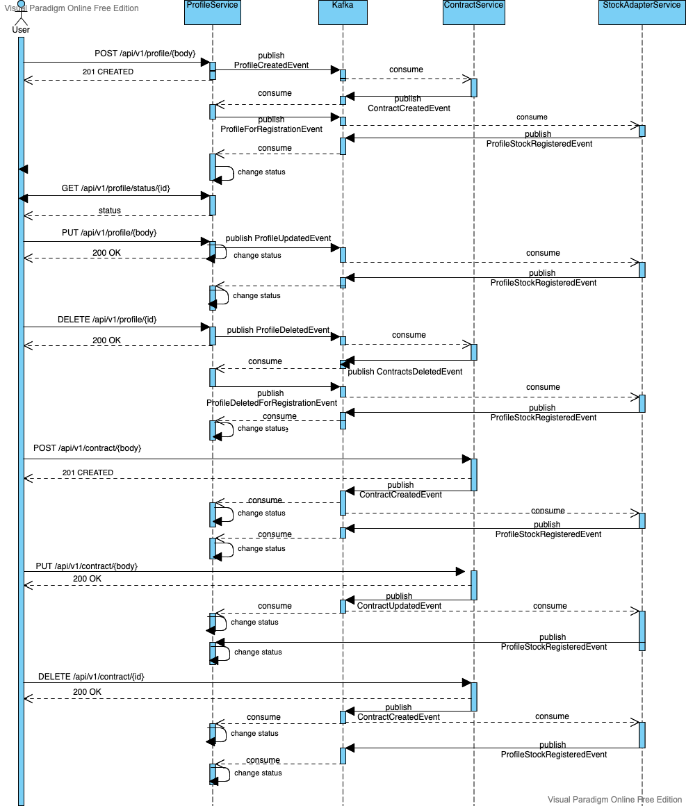

## Декомпозиция микросервисов для регистрации клиента на бирже

1. [Пользовательские сценарии](#Пользовательские-сценарии)
2. [Системные действия](#Системные-действия)
3. [Функциональная модель](#Функциональная-модель)
4. [Итоговая схема](#Итоговая-модель)
5. [Схема взаимодействия сервисов](#Схема-взаимодействия-сервисов)
6. [Системные действия в виде API](#Системные-действия-в-виде-API)
7. [Описание сервисов](#Описание-сервисов)

### Пользовательские сценарии

Клиент авторизуется в системе
Клиент может зарегистрироваться на бирже, указывая  коды подключаемых площадок.
Клиент может проверить статус регистрации на бирже. 
Клиент может добавить торговую площадку к договору
Клиент может удалить торговую площадку у договора
Клиент может добавить договор
Клиент может удалить договор
Клиент может изменить информацию в профиле.
Клиент может удалить регистрацию с биржи

Когда клиент нажимает кнопку "Зарегистрироваться на бирже", создается новый профиль, который имеет статус "На регистрации",
создается новый договор с указанными площадками, заявление с кодом договороа отправляется на биржу.
Когда регистрация на бирже подтверждена, профиль клиента меняет свой статус на "Зарегистрирован" 

Когда клиент нажимает кнопку "Добавить торговую площадку к договору", профиль клиента меняет свой статус "На регистрации",
у договора создается новая площадка, информация о новой площадке должна быть передана на биржу, после ответа биржи об успешной регистрации,
статус профиля меняется на "Зарегистрирован"

Когда клиент нажимает кнопку "Удалить торговую площадку у договора", профиль клиента меняет свой статус "На регистрации",
у договора удаляется площадка, информация об удаленной площадке должна быть передана на биржу, после ответа биржи об успешной регистрации,
статус профиля меняется на "Зарегистрирован".

Когда клиент нажимает кнопку "Удалить договор", профиль клиента меняет свой статус "На регистрации",
договор с площадками удаляется, информация об удаленном договоре должна быть передана на биржу, после ответа биржи об успешной регистрации,
статус профиля меняется на "Зарегистрирован".

Когда клиент нажимает кнопку "Добавить договор", профиль клиента меняет свой статус "На регистрации",
добавляется договор с торговыми площадками, информация о новом договоре должна быть передана на биржу, после ответа биржи об успешной регистрации,
статус профиля меняется на "Зарегистрирован".

Когда клиент нажимает кнопку "Изменить информацию в профиле", профиль клиента меняет свой статус "На регистрации", заявление отправляется на биржу, после ответа
биржи об успешной регистрации, статус профиля меняется на "Зарегистрирован"

Когда клиент нажимает кнопку "Удалить регистрацию с биржи", профиль клиента меняет свой статус "На регистрации",
информация об удалении регистрации должна быть передана на биржу, после ответа биржи об успешной регистрации,
статус профиля меняется на "Регистрация удалена".

### Системные действия:
Клиент авторизуется в системе
Клиент может зарегистрироваться на бирже, указывая  коды подключаемых площадок.
Клиент может проверить статус регистрации на бирже. 
Клиент может добавить торговую площадку к договору
Клиент может удалить торговую площадку у договора
Клиент может добавить договор
Клиент может удалить договор
Клиент может изменить информацию в профиле.
Клиент может удалить регистрацию с биржи
Приложение сохраняет информацию о пользователе
Приложение сохраняет информацию о профиле
Приложение сохраняет информацию о договорах и торговых площадках
Приложение отправляет информацию на биржу

### Функциональная модель

Сервисы:
- AuthService (сервис авторизации)
- ProfileService (добавление/редактирование/удаление профиля клиента)
- ContractService (добавление/редактирование/удаление договора с торговыми площадками)
- StockAdapterService (передача информации на биржу) 

### Итоговая модель

Сервисы:
- AuthService  
- ProfileService  
- ContractService  
- StockAdapterService  

### Схема взаимодействия сервисов

### Системные действия в виде API

**ms_auth**
- регистрация POST /api/v1/auth/register { firstName, lastName, email, password }
- авторизация POST /api/v1/auth/login { email, password }

**ms_profile**
- создание профиля клиента POST /api/v1/profile/{body}
- получение статуса профиля GET /api/v1/profile/status/{id}
- изменение профиля клиента PUT /api/v1/profile/{body}
- удаление профиля клиента DELETE /api/v1/profile/{id}
- удаление профиля клиента (удаление регистрации) DELETE /api/v1/prifile/{id}
- создание события о новом профиле ProfileCreatedEvent {profileId, markets}
- получение события о регистрации на бирже ProfileStockRegisteredEvent{profileDto}
- создание события об изменении профиля ProfileUpdatedEvent{profileDto}
- создание события об удалении профиля ProfileDeletedEvent{profileDto}
- получение события о создании договора ContractCreatedEvent{profileId, contractDto}
- получение события об изменении договора ContractCreatedEvent{profileId, contractDto}
- получение события об удалении договора ContractCreatedEvent{profileId, contractDto}
- получение события об удалении всех договоров клиента ContractsDeletedEvent{profileId}
- создание события о необходимости зарегистрировать новый профиль с договорами ProfileForRegistrationEvent {profileDto}
- создание события о необходимости зарегистрировать удаление профиля ProfileDeletedForRegistrationEvent{profileDto}

**ms_contract**
- создание договора с торговыми площадками POST /api/v1/contract/{body}
- обновление договора с торговыми площадкаим PUT /api/v1/contract/{body}
- удалить договор клиента DELETE /api/v1/contract/{id}
- получение события создание события о новом профиле ProfileCreatedEvent {profileId, markets}
- создание события о создании договора ContractCreatedEvent{profileId, contractDto}
- создание события об изменении договора ContractUpdatedEvent{profileId, contractDto}
- создание события об удалении договора ContractDeleteEvent{profileId, contractDto}
- получение события об удалении профиля ProfileDeletedEvent{profileId}
- создание события об удалении всех договоров клиента ContractsDeletedEvent{profileId}

**ms_stockAdapter**
- получение события о необходимости зарегистрировать новый профиль с договорами ProfileForRegistrationEvent {profileDto}
- получение события о необходимости зарегистрировать удаление профиля ProfileDeletedForRegistrationEvent{profileDto
- получение события об изменении профиля ProfileUpdatedEvent{profileDto}
- получение события об изменении договора ContractUpdatedEvent{profileId, contractDto}
- получение события об добавлении договора ContractCreatedEvent{profileId, contractDto}
- получение события об удалении договора ContractDeleteEvent{profileId, contractDto}
- создание события о регистрации на бирже ProfileStockRegisteredEvent{profileDto}

### Описание сервисов

----------------------

**Название**: ms_auth  
**Описание**: Сервис для хранения информации о пользователях. 
 
**Запросы**:

**Команды**:
- регистрация POST /api/v1/auth/register { firstName, lastName, email, password }
- авторизация POST /api/v1/auth/login { email, password }

**События**: -  
**Зависимости**: -

----------------------

**Название**: ms_profile  
**Описание**: Сервис для хранения информации о профиле клиента 
 
**Запросы**:
- получение статуса профиля GET /api/v1/profile/status/{id}

**Команды**:
- создание профиля клиента POST /api/v1/profile/{body}
- изменение профиля клиента PUT /api/v1/profile/{body}
- удаление профиля клиента (удаление регистрации) DELETE /api/v1/profile/{id}

**События**: 
- создание события о новом профиле ProfileCreatedEvent {profileId, markets}
- создание события об изменении профиля ProfileUpdatedEvent{profileDto}
- создание события об удалении профиля ProfileDeletedEvent{profileDto}
- создание события о необходимости зарегистрировать новый профиль с договорами ProfileForRegistrationEvent {profileDto}
- создание события о необходимости зарегистрировать удаление профиля ProfileDeletedForRegistrationEvent{profileDto}

**Зависимости**:
- получение события о регистрации на бирже ProfileStockRegisteredEvent{profileDto}
- получение события о создании договора ContractCreatedEvent{profileId, contractDto}
- получение события об изменении договора ContractCreatedEvent{profileId, contractDto}
- получение события об удалении договора ContractCreatedEvent{profileId, contractDto}
- получение события об удалении всех договоров клиента ContractsDeletedEvent{profileId}

----------------------
**Название**: ms_contract  
**Описание**: Сервис для хранения информации о договорах клиента
**Запросы**:-

**Команды**:
- создание договора с торговыми площадками POST /api/v1/contract/{body}
- обновление договора с торговыми площадкаим PUT /api/v1/contract/{body}
- удалить договор клиента DELETE /api/v1/contract/{id}

**События**:
- создание события о создании договора ContractCreatedEvent{profileId, contractDto}
- создание события об изменении договора ContractUpdatedEvent{profileId, contractDto}
- создание события об удалении договора ContractDeleteEvent{profileId, contractDto}
- создание события об удалении всех договоров клиента ContractsDeletedEvent{profileId}

**Зависимости**:
- получение события создание события о новом профиле ProfileCreatedEvent {profileId, markets}
- получение события об удалении профиля ProfileDeletedEvent{profileId}

----------------------
**Название**: ms_stockAdapter  
**Описание**: Сервис адаптер биржи
**Запросы**:  
**Команды**:
**События**:
- создание события о регистрации на бирже ProfileStockRegisteredEvent{profileDto}

**Зависимости**: 
- получение события о необходимости зарегистрировать новый профиль с договорами ProfileForRegistrationEvent {profileDto}
- получение события о необходимости зарегистрировать удаление профиля ProfileDeletedForRegistrationEvent{profileDto
- получение события об изменении профиля ProfileUpdatedEvent{profileDto}
- получение события об изменении договора ContractUpdatedEvent{profileId, contractDto}
- получение события об добавлении договора ContractCreatedEvent{profileId, contractDto}
- получение события об удалении договора ContractDeleteEvent{profileId, contractDto}

----------------------
